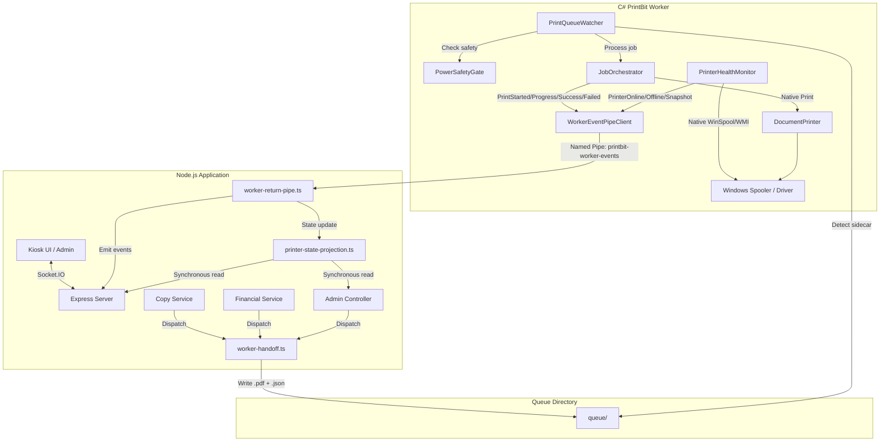

# Architectural Design: Migrating Printer & Spooler Subsystem to C# Worker

**Date:** 2026-09-02  
**Status:** Approved for Implementation  
**Phase:** Phase 1 of Master Worker Migration

---

## 1. Overview & Objectives

In the PrintBit kiosk architecture, Node.js previously handled Windows spooler querying, printer status checking, and print dispatching via frequent child-process spawns (`powershell.exe`, WMI, Sumatra, Ghostscript, PDFtoPrinter). This created significant CPU overhead, context switching, and state synchronization conflicts between Node and the running C# worker host (`printbit-worker`).

This design specification establishes **Phase 1** of the migration roadmap:

1. **Retire heavy Node-side printer services**: Remove `print-spooler.ts`, `printer-status.ts`, `printer-monitor.ts`, `windows-printer-edge.ts`, and `print-dispatcher.ts` from Node.js.
2. **Designate C# Worker as single source of truth**: Native WinSpool and WMI monitoring (`PrinterHealthMonitor.cs`) in C# become authoritative for physical hardware and Windows spooler health.
3. **Establish reactive in-memory projection in Node**: Replace continuous PowerShell polling loops with `printer-state-projection.ts`, which consumes named-pipe IPC events from C# (`PrinterOnline`, `PrinterOffline`, `PrinterError`, `PrinterStatusSnapshot`).
4. **Converge all print dispatch on Queue Handoff**: Route Copy, Customer Print, and Admin Test Page jobs through the established atomic filesystem queue handoff (`.pdf` + `.json` sidecar) monitored by C#'s `PrintQueueWatcher`.

---

## 2. File Inventory & Disposition

### 2.1 Files to Retire in Node.js (`printbit/src/services`)

- `print-spooler.ts` (~71 KB, 2066 lines):
  - _Reason for Retirement:_ Runs concurrent PowerShell runspaces polling `Get-PrintJob` every 500–1000ms. All spooler tracking is native in C# via `PrinterHealthMonitor` and `IJobOrchestrator`.
- `printer-status.ts` (~52 KB, 1633 lines):
  - _Reason for Retirement:_ Repeatedly executes `runPowerShell` to query `Get-Printer`, WMI, and SNMP. Replaced by `printer-state-projection.ts`.
- `printer-monitor.ts`:
  - _Reason for Retirement:_ Polling hook into `printer-status.ts` for watchdog heartbeats. Replaced by event-driven updates.
- `windows-printer-edge.ts`:
  - _Reason for Retirement:_ Redundant PowerShell wrappers for printer edge status.
- `print-dispatcher.ts` (~28 KB, 862 lines):
  - _Reason for Retirement:_ Spawns Sumatra, GhostScript, and PDFtoPrinter external processes directly from Node. Replaced by worker queue handoff.
- `printer-fault-lock.ts`:
  - _Reason for Retirement:_ Physical gating is managed in C# by `PowerSafetyGate` and `PrinterOperationCoordinator`.

### 2.2 Files to Create or Update in Node.js

- `src/services/printer-state-projection.ts` **[NEW]**:
  - In-memory cache tracking `{ connected, name, status, lastCheckedAt, error }`.
  - Synchronous reads (`getSnapshot()`, `isReady()`) with 0% CPU and zero child processes.
  - Driven by events from `worker-return-pipe.ts`.
- `src/services/worker-return-pipe.ts` **[MODIFY]**:
  - Add parsing and handling for `PrinterStatusSnapshot` events.
  - Direct incoming printer health events (`PrinterOnline`, `PrinterOffline`, `PrinterError`, `PrinterStatusSnapshot`) into `printer-state-projection`.
- `src/services/printer.ts` **[MODIFY]**:
  - Remove `powershell.exe` printer detection and Sumatra fallback.
  - Refactor `printFile()` to invoke `handoffToWorker()` for queue handoff.
- `src/modules/copy/copy.service.ts` **[MODIFY]**:
  - Remove `monitorSpoolerJob()` invocation.
  - Use event listener on `worker-return-pipe` for terminal completion (`workerPrintSucceeded`, `workerPrintFailed`).
- `src/modules/financial/financial.service.ts` **[MODIFY]**:
  - Remove `monitorSpoolerJob()` invocation.
  - Rely on `worker-return-pipe` events to trigger post-spooler receipt and ledger finalization.
- `src/modules/admin/admin.controller.ts` **[MODIFY]**:
  - Direct telemetry queries to `printer-state-projection.ts`.
  - Route test-page printing via `printer.printFile()` queue handoff.
- `src/services/index.ts` **[MODIFY]**:
  - Remove barrel exports for retired printer and spooler services.

### 2.3 Enhancements in C# Worker (`printbit-worker`)

- `PrintBit.Infrastructure.Windows/PrinterMonitoring/PrinterHealthMonitor.cs`:
  - Add initial `PrinterStatusSnapshot` broadcast on startup and client connection.
- `PrintBit.Infrastructure/IPC/WorkerEventPipeClient.cs` & `WorkerPrintEvent.cs`:
  - Ensure `PrinterStatusSnapshot` is mapped and delivered with current printer name and readiness status.

---

## 3. Component Architecture & Data Flow



---

## 4. Queue Handoff & Event Contract

### 4.1 Sidecar JSON Schema

Written to `queue/{transactionId}_{spoolerCorrelationKey}_{timestamp}.json`:

```json
{
  "copies": 1,
  "color": false,
  "pageRange": null,
  "orientation": "portrait",
  "quality": "standard",
  "schemaVersion": 2,
  "transactionId": "tx-12345",
  "spoolerCorrelationKey": "spool-67890"
}
```

### 4.2 Lifecycle Event Payloads

Streamed over `\\.\pipe\printbit-worker-events`:

- **`PrintStarted`**: Indicates physical print dispatch has begun.
- **`PrintProgress`**: Emits `pagesPrinted` and `totalPages` as tracked by native WinSpool/WMI in C#.
- **`PrintSucceeded`**: Emits `outcome: "completed"`. Triggers transaction settlement and receipt emission in Node.
- **`PrintFailed`**: Emits `outcome: "failed"`, `errorMessage`, and `failureStage`. Triggers customer refund and anomaly logging in Node.
- **`PrinterStatusSnapshot` / `PrinterOnline` / `PrinterOffline` / `PrinterError`**: Streams status directly into `printer-state-projection.ts`.

---

## 5. Error Handling & Resilience

1. **Queue Integrity**: `worker-handoff.ts` writes the PDF to a temporary file (`.tmp`) and atomically renames it before dropping the `.json` sidecar. This guarantees the C# watcher never encounters a partial PDF.
2. **Power Safety Lease**: `PrintQueueWatcher` verifies `TryAcquirePrintLease()` before dispatching. If the machine is on low battery or power is unstable, dispatch is deferred.
3. **Crash Recovery**: If the C# worker or Node restarts mid-job, sidecar files in `queue/` persist and are re-evaluated upon service startup.
4. **Automated Refund Trigger**: Any `PrintFailed` event with an associated `transactionId` immediately initiates `upsertSpoolerFailureRefund()` in Node, preventing lost customer funds without manual operator intervention.

---

## 6. Verification & Quality Gates

- **Build & Typecheck**:
  - Node: `npx tsc --noEmit` must pass with zero errors after deleting and modifying files.
  - C#: `dotnet build` in `printbit-worker` must compile cleanly.
- **Test Suites**:
  - Run existing and updated Jest unit tests in `printbit`:
    - `npm test -- tests/printer/`
    - `npm test -- src/modules/copy/copy.service.spec.ts`
    - `npm test -- src/modules/financial/financial.service.spec.ts`
- **Runtime Verification**:
  - Monitor Windows processes: verify zero `powershell.exe` instances are spawned during idle kiosk operation or print dispatch.
  - Confirm printer telemetry on `/admin` dashboard displays online/offline status correctly from `printer-state-projection`.
