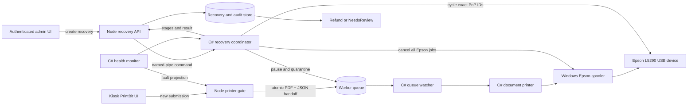

# Epson L5290 Assisted Recovery Design

**Date:** 2026-09-06

**Status:** Approved for implementation

**Scope:** `printbit` Node.js application and `printbit-worker` C# Windows service

## 1. Summary

PrintBit will add an assisted recovery workflow for persistent Epson L5290 hardware faults. The C# Worker detects the fault automatically and immediately gates further print dispatch, but it does not delete work or reset hardware without an authenticated operator action. An operator uses **Reset Printer & Clear Queue** in the admin panel to clear all live PrintBit and Windows spooler jobs, cycle the configured Epson Plug and Play (PnP) device, reconcile affected payments, and reopen printing only after the printer is healthy.

The recovery is intentionally destructive and therefore operator-triggered. It is idempotent, auditable, crash-recoverable, and restricted to the configured Epson device. The Epson Status Monitor is disabled for the Assigned Access account so that the kiosk remains focused on PrintBit.

The implementation also enforces a single C# Worker instance. Production investigation found two `PrintBit.HardwareService.exe` processes running concurrently. The existing queue watcher only has an in-process duplicate guard, so two processes can race on the same sidecars and submit a document more than once.

## 2. Problem Statement

An Epson L5290 can retain an error on its LCD while the Epson Status Monitor remains active. Physically unplugging and reconnecting the printer changes its device status, cancels the faulted work, and restores the printer to Idle. Restarting only the Windows spooler does not reproduce that hardware reset.

This creates three operational problems:

1. The printer can remain faulted even after the physical cause has been corrected.
2. Queue work can be rediscovered or duplicated while the device and application disagree about printer state.
3. Epson Status Monitor can display over the Assigned Access kiosk, even though printer faults are already represented inside PrintBit.

The settings written from `src/public/config` are already carried in Worker sidecars (`copies`, `color`, `pageRange`, `orientation`, and `quality`). This design preserves those settings and fixes recovery and queue ownership rather than changing print configuration.

## 3. Goals

- Detect Epson hardware errors in the C# Worker and stop new print dispatch automatically.
- Keep destructive recovery behind authenticated admin authorization.
- Clear all live jobs from the Epson Windows queue and the C# handoff queue.
- Reproduce unplug/replug behavior by cycling only the saved Epson L5290 PnP device interfaces.
- Temporarily tolerate the scanner disconnect caused by cycling the multifunction device.
- Return to Idle only after USB rediscovery, queue availability, and printer health verification.
- Refund jobs confirmed as unprinted and route partial or uncertain work to `NeedsReview`.
- Keep the kiosk restricted to PrintBit with no Epson Status Monitor window.
- Prevent multiple Worker processes from consuming the same handoff files.
- Emit concise, structured C# logs without polling noise or customer document data.

## 4. Non-Goals

- Automatically deleting jobs or cycling USB hardware merely because a transient error was detected.
- Guessing whether an uncertain or partially printed job deserves a full refund.
- Cycling all Epson devices or all USB devices when the configured device identity is missing.
- Using Node.js to execute privileged spooler or PnP commands.
- Making the C# Windows service manipulate windows in the interactive kiosk session.
- Reprinting quarantined work automatically after recovery.
- Replacing the existing print-option contract from `src/public/config`.

## 5. Ownership Boundaries

### 5.1 C# Worker

The C# Worker is authoritative for:

- physical printer health and error detection;
- the dispatch gate and active print cancellation;
- the Worker filesystem handoff queue;
- the Epson Windows spooler queue;
- PnP disable, enable, rediscovery, and health verification;
- recovery stage and operational result;
- the machine-wide single-instance guarantee.

### 5.2 Node.js application

Node.js is authoritative for:

- admin authentication and authorization;
- creating and persisting the recovery intent;
- API idempotency and operator audit data;
- the operator-facing recovery status;
- application job state and transaction settlement;
- refunds and `NeedsReview` records;
- gating new customer submissions before handoff.

### 5.3 Kiosk provisioning

The installation and kiosk-hardening scripts own:

- disabling **EPSON Status Monitor 3** for the Assigned Access account;
- excluding Epson status-monitor executables from the kiosk allowlist;
- discovering, validating, and saving exact L5290 PnP instance identifiers;
- removing duplicate Worker launch paths so the service is the only configured host.

Windows isolates services in Session 0, so the Worker must not attempt to close or control windows in the kiosk user's interactive session. See [Microsoft's interactive services guidance](https://learn.microsoft.com/en-us/windows/win32/services/interactive-services). Epson documents an **Enable EPSON Status Monitor 3** driver setting in the [L5290 User's Guide](https://files.support.epson.com/docid/cpd6/cpd60263.pdf).

## 6. Architecture



The Node gate and Worker gate are both required. The Node gate prevents a new paid submission from entering recovery, while the Worker gate remains authoritative if Node is unavailable or a handoff is already in flight.

## 7. Recovery State Model

The operator-facing availability state is separate from the detailed recovery stage.

```text
IDLE
  -> RECOVERY_REQUIRED       automatic hardware fault detection
  -> RECOVERING              authenticated recovery accepted
  -> IDLE                    health verification succeeded

RECOVERING
  -> RECOVERY_REQUIRED       any recovery stage failed or timed out
```

Detailed recovery stages are:

```text
CREATED
-> CLEARING_QUEUES
-> CYCLING_DEVICE
-> WAITING_FOR_DEVICE
-> VERIFYING_HEALTH
-> SUCCEEDED
```

`FAILED` is terminal for a particular recovery ID. A retry creates a new recovery intent after the previous result is known. A timeout is treated as an unknown outcome until reconciliation confirms the hardware state; it must never cause an automatic second device cycle.

## 8. Fault Detection

The existing C# health monitor continues to inspect the configured Epson queue and hardware state. A hardware fault creates one error episode and changes availability to `RECOVERY_REQUIRED`.

Detection behavior:

- Close the Worker dispatch gate immediately.
- Signal cancellation to an active dispatch and let queue clearing perform authoritative spooler cancellation.
- Publish one fault snapshot to Node.js with a stable episode ID, normalized fault code, detected time, printer name, and safe display message.
- Do not delete files, cancel all jobs, cycle hardware, or issue refunds automatically.
- Deduplicate repeated observations of the same fault episode.
- Keep the gate closed if Node.js is disconnected.

Clearing a physical cause does not reopen dispatch while an error episode has queued or uncertain work. Reopening requires the approved recovery workflow or an explicit safe reconciliation proving that no affected work exists.

## 9. Admin API Contract

### 9.1 Read recovery status

`GET /api/admin/printer/recovery`

The authenticated response includes:

```ts
interface PrinterRecoveryView {
  availability: 'IDLE' | 'RECOVERY_REQUIRED' | 'RECOVERING';
  detectedFault: {
    episodeId: string;
    code: string;
    message: string;
    detectedAt: string;
  } | null;
  activeRecovery: PrinterRecoverySummary | null;
  affectedJobCount: number;
  canReset: boolean;
}
```

### 9.2 Create a recovery

`POST /api/admin/printer/recoveries`

Requirements:

- authenticated maintenance/admin role;
- a stable `Idempotency-Key` generated once for the operator's reset intent;
- boundary validation of all input and Worker responses;
- atomic persistence of the idempotency key and request hash before calling C#.

The endpoint returns `202 Accepted` with a `recoveryId` and status URL. Reusing the same key and payload returns the same recovery. Reusing a key with a different payload returns `422`. A different request while recovery is active returns `409`.

Errors use the application's standard structured error envelope and never expose PnP identifiers, filesystem paths, or command text.

### 9.3 Worker command contract

The named-pipe recovery command includes:

- `recoveryId`;
- `faultEpisodeId`;
- configured printer queue name;
- exact, previously validated PnP instance identifiers;
- affected application job identifiers and spooler correlation keys;
- schema version.

The C# response is a discriminated result containing the recovery ID, terminal state, failed stage when applicable, stable error code, duration, queue counts, and device-verification result.

## 10. Atomicity and Idempotency

Recovery crosses a database, filesystem queue, Windows spooler, and PnP subsystem, so it is implemented as a persisted saga rather than pretending to be one transaction.

- Node.js persists the recovery intent and closes its gate before sending the Worker command.
- C# acquires one process-wide recovery lock shared with dispatch.
- The persisted recovery ID makes retries observable.
- C# records stage completion durably enough to reconcile a service restart.
- A duplicate command for an active or completed recovery ID returns its current result and never cycles the device again.
- Quarantining a queue pair uses atomic moves on the same volume.
- A sidecar and its matching PDF are treated as one unit; malformed or incomplete pairs are also removed from the live queue and reported.
- Startup reconciliation keeps dispatch closed whenever a nonterminal recovery or nonempty recovery quarantine exists.

## 11. Queue Clearing and Settlement

The approved destructive action follows this order:

1. Node.js closes the customer-submission gate before creating the Worker command.
2. C# closes its dispatch gate and pauses the queue watcher.
3. C# cancels the active dispatch operation.
4. C# moves every live Worker queue PDF/JSON pair into a recovery-specific quarantine directory.
5. C# removes every job from the configured Epson Windows queue, including the currently printing job. Windows exposes this through `Win32_Printer.CancelAllJobs`; see the [Microsoft documentation](https://learn.microsoft.com/en-us/windows/win32/cimwin32prov/cancelalljobs-method-in-class-win32-printer).
6. C# waits for the configured queue to confirm empty or fails the `CLEARING_QUEUES` stage.
7. C# performs the device cycle and health verification.
8. Node.js reconciles all affected application jobs.
9. Quarantined document content is deleted according to the current secure document-retention policy after reconciliation. Minimal non-document audit metadata remains.

Settlement classification:

- **Confirmed unprinted:** automatically refund.
- **Partial progress:** create `NeedsReview`; do not guess a refund.
- **Unknown outcome:** create `NeedsReview`.
- **Confirmed completed before the fault:** retain completed settlement and exclude from refund.
- **Created while the gate is closed:** reject before charging or handoff.

No quarantined job is automatically restored or reprinted.

## 12. PnP Device Cycle

The reset approximates a physical unplug/replug:

1. Resolve the saved PnP instance IDs and verify that they still describe the configured Epson L5290 device container.
2. Refuse recovery if identity is absent, ambiguous, or has drifted.
3. Disable the required printer/scanner interfaces under the one validated device container.
4. Wait for the device interfaces to leave the active state.
5. Re-enable the same interfaces.
6. Wait with a bounded timeout for USB rediscovery, the configured Windows printer queue, and scanner availability.
7. Require a stable healthy printer observation before reopening dispatch.

PnP enable/disable requires administrator rights, which are available to the privileged Worker service. See Microsoft's [`Enable-PnpDevice` documentation](https://learn.microsoft.com/en-us/powershell/module/pnpdevice/enable-pnpdevice?view=windowsserver2025-ps). Implementation should place PnP operations behind a C# adapter so production can use the appropriate native/CIM mechanism and tests can use a fake.

The recovery must never broaden its target by friendly-name wildcard. If the saved identity cannot be proved, it fails closed and instructs maintenance to repair device configuration.

## 13. Kiosk Isolation

Assigned Access must show only PrintBit.

- Disable EPSON Status Monitor 3 for the assigned kiosk profile during installation and expose a maintenance verification check.
- Do not launch Epson utilities from Node.js or C# recovery code.
- Remove Node-side attempts to use `taskkill` as the primary status-monitor control once provisioning owns the setting.
- Keep Epson status-monitor executables outside the kiosk allowlist.
- Surface all hardware errors and recovery progress inside PrintBit.
- If configuration verification detects that Status Monitor is enabled, report a maintenance warning without opening the utility.

## 14. C# Logging Policy

Logs are structured, concise, and event-based.

Required events:

| Level | Event | Cardinality | Safe fields |
|---|---|---:|---|
| Warning | `PrinterRecoveryRequired` | Once per fault episode | episode ID, fault code, printer alias |
| Information | `PrinterRecoveryStarted` | Once per recovery | recovery ID, episode ID |
| Information | `PrinterRecoverySucceeded` | Once per recovery | recovery ID, duration, cleared spooler count, quarantined pair count |
| Error | `PrinterRecoveryFailed` | Once per recovery | recovery ID, failed stage, stable error code, duration |
| Critical | `WorkerInstanceAlreadyRunning` | Once, then exit | service/host identity only |

Rules:

- Do not log unchanged health polls or repeated observations of the same error.
- Log stage transitions at Debug, not Information, unless they exceed a warning threshold.
- Do not log document names, document content, student data, payment details, full paths, raw command lines, or full PnP identifiers.
- Use stable event IDs and error codes so operations can filter without parsing prose.
- Node.js retains the business audit: operator ID, timestamps, affected transaction IDs, refund decisions, review cases, and Worker result.

## 15. Single-Instance Worker

The Worker must acquire a machine-wide named mutex or equivalent OS-level exclusive lock before starting queue consumers or command pipes.

- The service instance is the intended owner.
- A second process emits `WorkerInstanceAlreadyRunning` and exits with a distinct nonzero code.
- The existing in-memory sidecar guard remains useful within one process but is not considered a cross-process correctness mechanism.
- Installation removes any scheduled task, startup shortcut, or script that launches a second Worker host.
- Queue claiming should also become atomic so a future configuration error cannot duplicate dispatch merely because two consumers briefly overlap during upgrade.

## 16. Admin Experience

The admin System page adds a printer recovery card showing:

- current availability and normalized fault;
- detection time;
- affected-job count;
- **Reset Printer & Clear Queue** button;
- destructive-action confirmation;
- current recovery stage and elapsed time;
- terminal success or actionable failure;
- automatic refund count;
- `NeedsReview` count and navigation to those records.

The reset button is disabled while recovery is active. Closing or refreshing the browser does not cancel recovery; the page reloads the persisted state. The kiosk customer screen shows a PrintBit-owned temporary-unavailable state and accepts no payment while gated.

## 17. Failure Handling

- **Node unavailable after intent creation:** C# can finish the known recovery; Node reconciles the persisted ID on restart.
- **Worker unavailable:** the API retains the recovery as pending/unknown, keeps the Node gate closed, and does not create a replacement intent automatically.
- **Spooler cannot clear:** fail at `CLEARING_QUEUES`; do not cycle hardware or reopen printing.
- **PnP disable succeeds but enable fails:** remain `RECOVERY_REQUIRED`, preserve the failed stage, and give maintenance an explicit device-enable action.
- **Device returns but printer remains unhealthy:** fail verification and keep printing gated.
- **Scanner does not return:** fail verification because the approved cycle covers the multifunction device.
- **Settlement fails:** keep the recovery outcome and business reconciliation pending; do not reprint documents.
- **Status Monitor appears:** kiosk configuration is noncompliant; report it to maintenance without manipulating the window from the service.

## 18. Verification

### 18.1 Unit tests

- Recovery state-machine transitions and failed-stage preservation.
- Fault-episode and log deduplication.
- API authentication, authorization, schema validation, and error envelope.
- Atomic idempotency-key claim, payload mismatch, active conflict, and replay.
- Queue classification and quarantine behavior for valid, orphaned, and malformed pairs.
- Refund, completed, partial, and unknown settlement classification.
- Exact PnP identity validation and refusal of broad targets.
- Single-instance Worker behavior.

### 18.2 C# integration tests

Use fake spooler, PnP, health, queue-store, and clock adapters to prove this ordering:

```text
gate dispatch
-> cancel active work
-> quarantine handoffs
-> cancel Epson spooler jobs
-> verify queue empty
-> disable exact device
-> enable exact device
-> await printer and scanner
-> verify stable health
-> reopen dispatch
```

Tests also cover crashes/timeouts after every external side effect and prove that replaying the same recovery ID never repeats the device cycle.

### 18.3 Node.js integration tests

- Admin-only recovery creation and status projection.
- Double-click and network-retry safety.
- Gate-before-charge behavior.
- Worker timeout/unknown outcome handling.
- Refund and `NeedsReview` persistence.
- Restart reconciliation and admin page reload.

### 18.4 Controlled hardware acceptance

1. Confirm exactly one Worker process and one service owner.
2. Queue nonfinancial test documents.
3. Produce a recoverable Epson hardware/LCD error.
4. Verify automatic dispatch gating and one concise fault log.
5. Invoke the authenticated admin reset.
6. Verify the Windows spooler and live Worker queue are empty.
7. Verify printer and scanner disconnect and reconnect.
8. Verify the LCD error clears and the Worker reports Idle.
9. Submit one one-copy test job and verify exactly one physical copy.
10. Verify no Epson window appears over PrintBit.
11. Review Worker logs for only the required start/result events.

## 19. Rollout and Rollback

- Ship recovery behind an admin configuration switch.
- During installation, discover and require maintenance confirmation of the exact Epson device container and interfaces.
- Remove the duplicate launch path found on the current machine before enabling recovery.
- Run the controlled hardware acceptance test before enabling customer printing.
- If PnP cycling is unreliable, disable the recovery feature, leave printing gated on faults, and require manual unplug/replug. Do not fall back to broad USB reset or repeated automatic cycles.

## 20. Documentation Updates

Implementation changes the Worker policy that currently prohibits queue deletion and PnP reset. Update the Worker repository's `AGENTS.md` and operational documentation to state that these actions are allowed only inside an authenticated, persisted, idempotent recovery intent with exact device targeting. Update PrintBit installation and maintenance documentation with Status Monitor configuration, device identity enrollment, duplicate-launcher removal, recovery operation, settlement handling, and rollback.
